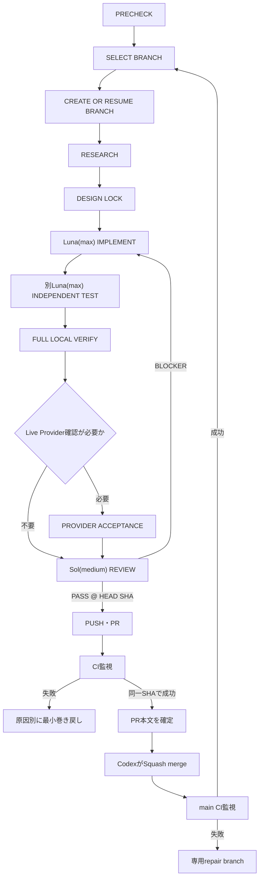

# SIT ORBITの実装Loop

この文書は、SIT ORBITをbranch単位で実装するための運用契約である。

Codex Goalは作業中の状態を管理し、GitとGitHubはbranch、commit、Pull Request、CI、mergeという永続的な事実を記録する。

独自の状態データベース、Queue、Workflow Engine、Multi-agent Framework、追加Gateは作らない。

## 開始条件

`codex/document-agent-architecture`のdocs変更をPRとして完成させ、CI成功後にSquash mergeする。

merge後の`main` CIがgreenになるまで、最初の実装branchを作成しない。

実装branchは常に最新の`origin/main`から作成する。

Repositoryのauto-merge設定や新しいRulesetは追加しない。

Codexは`main`へ直接pushせず、PRの最新HEADに対するrequired CIの成功を確認してから手動でmergeする。

## 有限状態Loop



終端状態は`DONE`と`BLOCKED`だけとする。

再開時はGoalの記憶だけを使わず、次を再観測して状態を復元する。

- `origin/main`
- 現在branchとHEAD SHA
- 未コミット差分
- Pull RequestとPRのHEAD SHA
- CI Checks
- merge状態
- merge後のmain CI

## branchの順序

`docs/implementation-plan.md`のroadmap branchだけを作成する。

Research、Test、Reviewのための追加branchは作らない。

1. `codex/extension-shell`
2. `codex/scombz-context-adapter`
3. `codex/sidepanel-agent-loop`
4. `codex/google-calendar-readonly`
5. `codex/google-drive-picker`
6. `codex/azure-demo-runtime`
7. `codex/pydantic-ai-adapter`（条件付き）

Branch 7は、Branch 6 merge後の最新mainで次の両方を満たす場合だけ作成する。

- `AgentBackend`またはProvider Adapterが実際に複雑化している。
- 複数Toolの逐次呼び出し、Tool結果の構造化統合、複数ターン状態、TestModelによるTool再現のいずれかが現在の要件になっている。

「将来使いそう」は導入理由にしない。

## Research

実装前に、次の順で調査する。

1. 現行コード、AGENTS.md、設計文書
2. 公式仕様と一次資料
3. 判断へ直接関係する原論文
4. 維持されているOSSと公式SDK
5. 類似実装

調査結果は、PR本文に次の分類で記録する。

- `SPEC`：公式仕様、API、権限、Platform capability
- `PAPER`：手法の有効性やtrade-offを扱う原論文
- `OSS`：再利用可能な実装、Library、Framework

各判断には次を残す。

```text
Question:
SPEC:
PAPER:
OSS:
ADOPT:
REJECT:
Reason:
```

直接適用できる論文がない場合は、無理に引用せず、その旨を記録する。

重要な判断に一次資料の根拠が付き、追加調査によって選択が変わらなくなった時点でResearchを終了する。

件数目標、独自スコアリング表、Research専用の評価基盤は作らない。

### Oracle

各roadmap branchのResearchでOracleを一度使用する。

実行前にAdvanced表示で次を確認する。

```text
Model: GPT-5.6 Sol
Effort: Extra High
Execution mode: Standard
Fallback: none
```

Pro、Terra、その他modelへのfallbackは禁止する。

Oracleへ渡すファイルは対象branchに必要なものだけに絞る。

Oracleの用途は次に限定する。

- OSSまたは技術方式の採用判断への助言
- production defectとtest defectを判別できないfailureの分類
- Branch 7の導入条件判定

Oracleへコード実装を依頼しない。

最終回答が返らない場合は同じセッションへ再接続し、重複実行しない。

指定modelを確認できない場合は`BLOCKED`とする。

## Design Lock

親Codexが実装前に次を固定する。

- 一つのユーザー体験
- 実装範囲と対象外
- 再利用するPlatform APIまたはOSS
- 変更する公開Interface
- 完了条件
- 必須テスト
- Live Provider確認の要否

timeout、retry、version、OAuth scopeなどの重要値は、公式仕様、既存挙動、計測結果のいずれかに基づいて決める。

## Agentの役割

同一branch上でwrite-heavy Agentを並列実行しない。

### Implementation Agent

Luna(max)をwrite-capableな実装担当として一人だけ呼び出す。

親Codexが設計、scope、diff、統合を管理する。

現branchの完了条件に不要な抽象化、依存、Serviceを追加しない。

Graph Database、Message Broker、Multi-agent Framework、独自Policy Engineは追加しない。

### Independent Test Agent

実装後、別のLuna(max)を呼び出す。

Test Agentが変更できるのはテスト、fixture、test helperだけとする。

production defectを発見した場合はproduction codeを修正せず、failureとして返す。

敵対的テストは次に限定する。

- 中核ユーザー体験
- ユーザーに見える重大な失敗
- Evidence、承認、PrivacyなどのProduct invariant
- B1大宮fixtureの回帰
- 外部APIを通常テストで呼ばないこと

style、命名、class数、関数長、些細なedge caseをテストで固定しない。

### Adversarial Reviewer

Full Local Verify後、Sol(medium)をread-only Reviewerとして呼び出す。

Reviewerの出力は次の形式に限定する。

```text
PASS
reviewed_sha: <HEAD SHA>
```

または、

```text
BLOCKERS:
- [CORE_VALUE] ...
- [COMPLEXITY] ...
- [OVERENGINEERING] ...
- [UX] ...
reviewed_sha: <HEAD SHA>
```

style、命名、好みのrefactor、微小最適化は報告しない。

Reviewer実行後にGit状態を確認し、Reviewerによる変更が存在した場合はレビューを無効にする。

## 検証

実装中は関連する最小テストだけを実行する。

Reviewer前にはCI相当の検証をすべて実行する。

```bash
uv sync --frozen
uv run ruff check .
uv run pyright
uv run pytest
PYTHONPATH=services/api uv run python -m evals.run_eval
uv run python scripts/check_secrets.py

pnpm install --frozen-lockfile
pnpm generate:api
git diff --exit-code -- packages/api-client
pnpm lint
pnpm typecheck
pnpm test
pnpm build
```

検証結果は、次のSHAへ紐付ける。

```text
verified_sha = <git rev-parse HEAD>
```

通常テストでは次を固定する。

```text
ORBIT_AGENT_BACKEND=fixture
ORBIT_OBSERVABILITY=off
OpenAI API disabled
W&B disabled
Google/Azure live API disabled
synthetic/public fixture only
```

Branch 1ではExtension packageにbuild、typecheck、test scriptを持たせ、既存`quality` CIの`pnpm build`がExtension production buildも実行するようにする。

新しいExtension専用Gateは作らない。

## Provider Acceptance

Branches 4〜6など、完了条件上Live Provider確認が不可避な場合だけ行う。

- Required CIとは分離する。
- 明示許可されたdemo account、synthetic data、public dataだけを使う。
- OAuth tokenやcredentialをログ、W&B、PRへ残さない。
- fixtureによる成功を実連携成功として扱わない。
- 権限不足は`BLOCKED`として報告する。

## SHAの不変条件

Sol Reviewの`reviewed_sha`、Full Local Verifyの`verified_sha`、PRのHEAD SHA、CIの対象SHAを記録する。

Review後に一文字でも変更、generated file更新、main同期、rebase、merge commit追加が発生した場合は、次を再実行する。

1. Independent Testの関連部分
2. Full Local Verify
3. Adversarial Review

CIだけの再実行でレビューを流用しない。

## Failure routing

failure fingerprintは新しいツールを作らず、次の正規化文字列とする。

```text
<stage>/<surface>/<stable-id>/<normalized-class>
```

timestamp、CI Run ID、一時path、不安定なline numberは含めない。

同じfingerprintはbranch内で累積し、3回目の観測で`BLOCKED`とする。

| 原因 | 戻り先 |
|---|---|
| API仕様、scope、OSS capabilityの前提誤り | 該当判断だけdelta Research |
| production behaviorの不具合 | Implement |
| test、fixture、期待値の誤り | Independent Test |
| production/testのどちらが原因か不明 | Oracleで分類 |
| build、type、config、toolchain | Implement |
| Sol blocker | Implement |
| 技術選択の前提崩壊 | 該当判断だけdelta Research |
| deterministic CI failure | 対応するlocal stage |
| transient CI疑い | コード変更なしで一度だけrerun |
| mainが先行した | main同期後にVerifyとReview |
| model、権限、実データ、external write条件不成立 | Blocked |

3回連続の修復で新しく成功する検証が一つも増えない場合も`BLOCKED`とする。

全Researchを最初からやり直さない。

## PRと手動Merge

Sol Review通過後に初めてbranchをpushする。

PR本文は日本語で作成し、branchの実装記録の正本とする。

```text
Branch:
Goal / Non-goals:

Research:
- SPEC <url> — finding
- PAPER <url> — finding、または直接適用なし
- OSS <url> — reuse candidate

Decisions:
- ADOPT ... — reason
- REJECT ... — reason

Implementation:
- changed surfaces
- preserved invariants

Tests:
- Independent Luna tests
- Full local PASS @ <sha>
- Provider acceptance PASS / N/A

Review:
- Sol(medium), read-only PASS @ <sha>

CI:
- quality PASS @ <sha>

Failures:
- <fingerprint> × N — resolution
```

PRの処理は次の順に行う。

1. `reviewed_sha`とbranch HEADが一致することを確認する。
2. branchをpushする。
3. PRを作成する。
4. `quality` CIを監視する。
5. 最新HEAD SHAに対するCI成功を確認する。
6. PR本文のCI欄を更新する。
7. `origin/main`が先行していないことを再確認する。
8. `gh pr merge --squash --delete-branch`で手動mergeする。
9. main push CIを監視する。
10. main CI成功をPR本文へ追記する。
11. mainがgreenになってから次のbranchを作成する。

GitHub auto-merge、Merge Queue、main直接push、force pushは使用しない。

merge後のmain CIが失敗した場合は、次のroadmap branchへ進まず、原因を診断して専用repair branchを作る。

## Goalへ登録する文章

docs PRがmainへmergeされ、main CIがgreenになった後、token budgetを指定せず次をGoalとして登録する。

```text
docs/implementation-plan.mdとdocs/implementation-loop.mdに従い、
SIT ORBITのBranches 1〜6を順番に完成させる。
Branch 7は文書の導入条件を現在の証拠が満たす場合だけ実装し、
満たさない場合は理由を記録してskipする。将来branchは対象外とする。

各branchは最新かつgreenなorigin/mainから作成する。
Research、Implement、Independent Test、Full Local Verify、
必要時のみProvider Acceptance、Adversarial Review、Push、PR CI、
Codexによる手動Squash merge、main CI確認の順に直列実行する。
Research、Test、Review用の追加branchは作らない。

ResearchではSPEC、PAPER、OSSを区別し、公式仕様を仕様判断の正本とする。
成熟OSSや公式SDKで解決できる範囲を独自実装しない。
重要な採用・不採用判断、scope、version、timeoutに根拠を残す。
直接適用できる論文がない場合は無理に引用しない。

各ResearchでOracleをGPT-5.6 Sol、Extra High、Standard mode、fallbackなしで使用する。
Proや別modelへ切り替えない。Oracleは技術判断、判別不能failureの分類、
Branch 7判定だけに使い、コードを書かせない。

実装はLuna(max)一人が行う。完了後、別のLuna(max)がtest、fixture、
test helperだけを変更して独立した敵対的テストを書く。
テストは中核価値、重大なUX、Product invariant、既存fixture回帰に限定する。

全ローカル検証後、Sol(medium)をread-only Reviewerとして呼び出す。
ReviewはCORE_VALUE、COMPLEXITY、OVERENGINEERING/YAGNI、UXだけを扱う。
Local VerifyとReviewのPASSをHEAD SHAへ紐付け、Review後にSHAが変わった場合は再実行する。

通常開発とCIではfixture、synthetic data、public dataだけを使用する。
OpenAI、W&B、Google、Azureのlive APIは呼ばない。
Provider確認が不可避なbranchだけ、通常CIと分離して確認する。

failureは原因を分類して最小の段階へ戻す。全Researchをやり直さない。
同一fingerprintの3回目、または3回の修復で新しい成功証拠が増えない場合は停止する。
transient CIのno-code rerunは一度だけ許可する。

Sol Review通過後にbranchをpushし、日本語PRを作成する。
PR本文をResearch、Decision、Implementation、Test、Review、CI、Failureの正本とする。
最新HEAD SHAのquality CI成功を確認し、Codexが手動でSquash mergeする。
merge後のmain CIがgreenになるまで次branchへ進まない。

無許可大学アクセス、実学生データ、未知のexternal write permission、
指定model/effort利用不能、Reviewerのread-only違反、破壊的操作、
current MVPを越えるmaterial expansionが必要な場合はfallbackせずBLOCKEDとする。

完了条件はBranches 1〜6のmerge、各main CIのgreen、Branch 7の実施またはskip判断、
各PR本文への調査・判断・テスト・レビュー・CI記録である。
```
